[返回OKE中文文档集](../README.md)

# Rancher和OKE及OCI的集成

Rancher可以和OKE及OCI进行集成，通过Rancher创建OKE集群和基于OCI的Compute Instace创建RKE集群。

## 1. 激活集群驱动的"Oracle OKE"，

   访问[Releases · rancher-plugins/kontainer-engine-driver-oke (github.com)](https://github.com/rancher-plugins/kontainer-engine-driver-oke/releases/)，拷贝最新版的下载URL和校验信息，以v1.8.2版本为例，

   - 下载URL: `https://github.com/rancher-plugins/kontainer-engine-driver-oke/releases/download/v1.8.2/kontainer-engine-driver-oke-linux`
   - 校验: `5957376639e22f1ec9e877e7ddd308d8ea939a11ee8625446d613b958e0822b2`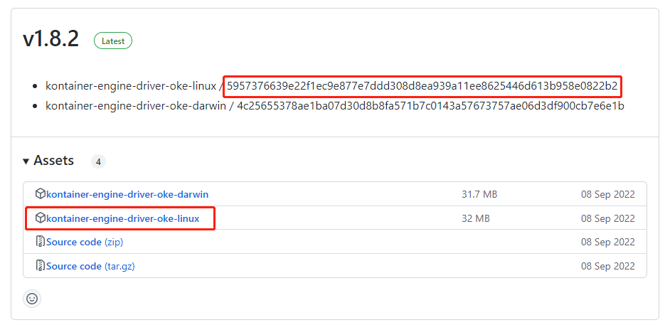

在Rancher管理页面，访问集群管理=>驱动，点击"Oracle OKE"右侧的下拉菜单=>"升级"，

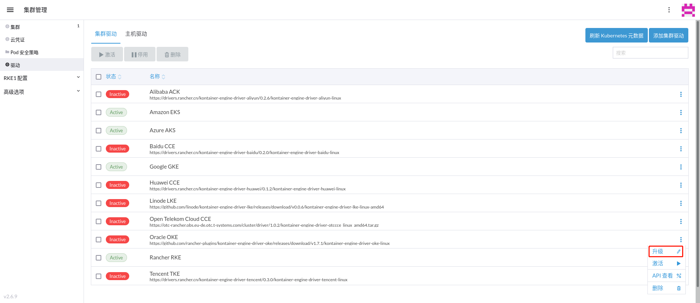

输入最新版的下载URL和校验信息，点击"保存"，

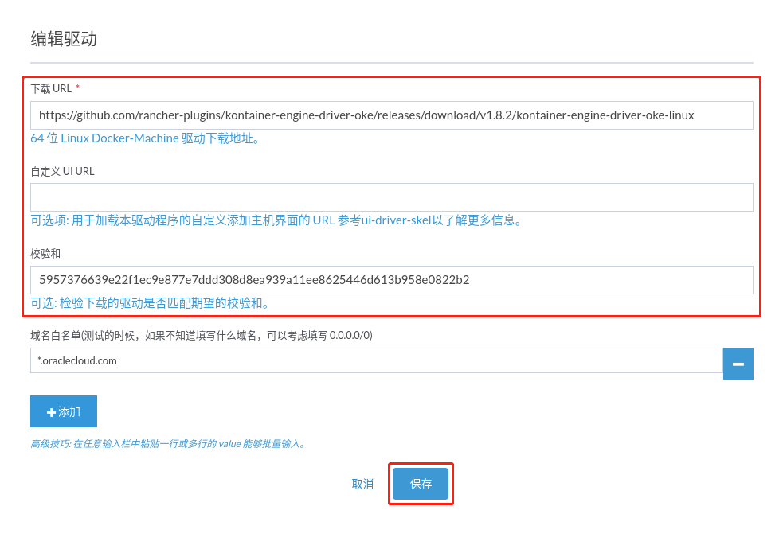

勾选"Oracle OKE"，点击"激活"，

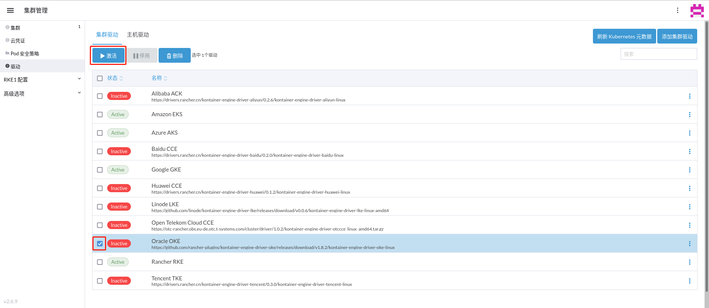

确认"Oracle OKE"变成"Active"状态，

## 2. 激活主机驱动的"Oracle Cloud Infrastructure"，

   访问https://github.com/rancher-plugins/rancher-machine-driver-oci/releases，拷贝最新版的下载URL和校验信息，以v1.3.0版本为例，

   - 下载URL: `https://github.com/rancher-plugins/rancher-machine-driver-oci/releases/download/v1.3.0/docker-machine-driver-oci-linux`

   - 校验: `0a1afa6a0af85ecf3d77cc554960e36e1be5fd12b22b0155717b9289669e4021`

     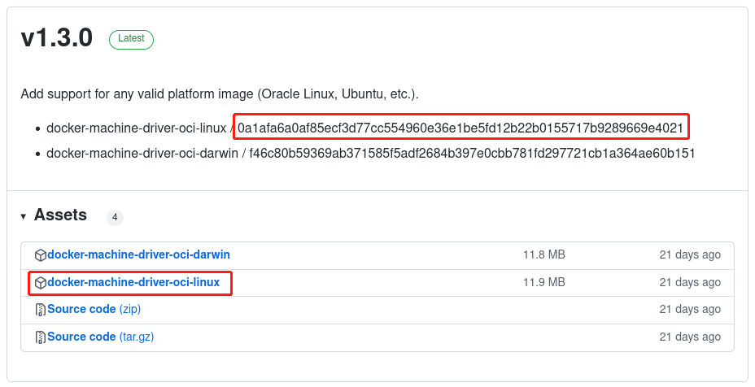

   在Rancher管理页面，访问集群管理=>驱动=>主机驱动，点击"Oracle Cloud Infrastructure"右侧的下拉菜单=>"升级"，

   

   勾选"Oracle Cloud Infrastructure"，点击"激活"，

   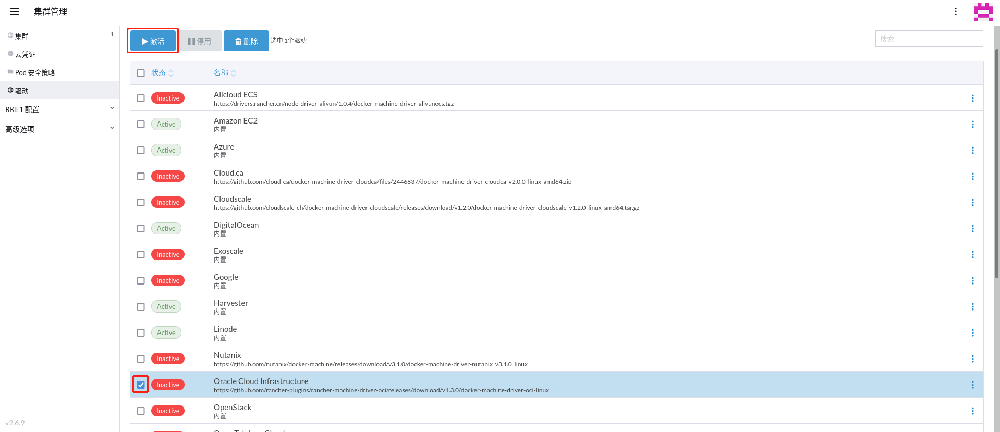

   确认"Oracle Cloud Infrastructure"变成"Active"状态，

   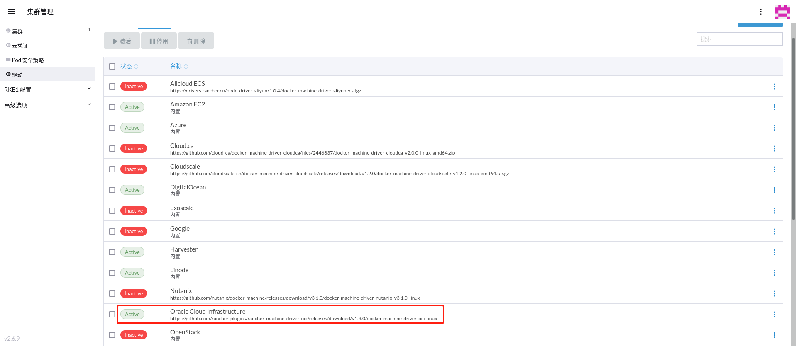

## 3. 创建OKE集群

   在Rancher管理页面，访问集群管理=>集群，点击"创建"，选择"Oracle OKE"，

   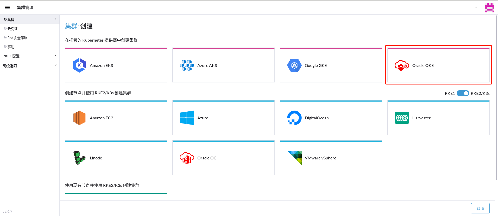

   输入各个项目的信息，点击"Next: Authenticate & Configure Cluster"，

   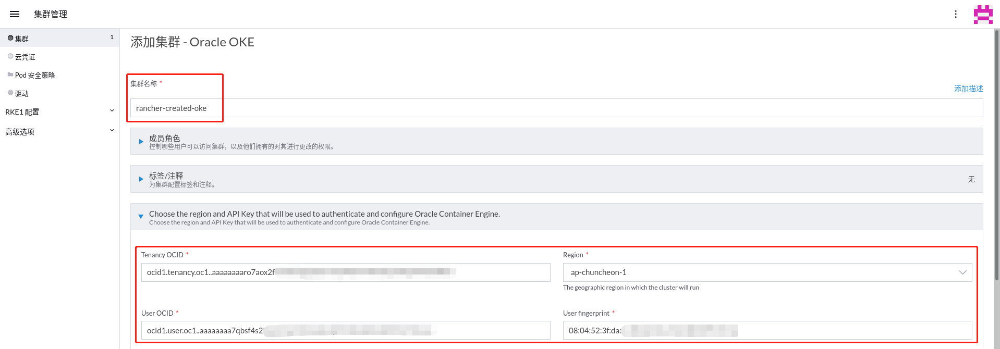

   

   输入各个项目的信息，点击"Next: Configure Virtual Cloud Network"，

   

   选择"Quick Create"，点击"Next: Configure Node Instances"，

   

   输入各个项目的信息，点击"创建"，

   

   (Optional)在OCI的Kubernetes Clusters (OKE)页面，可以查看到有一个OKE集群正在创建中，在Rancher的管理页面需要经过一段时间后才能看见这个OKE集群的信息，

   

## 4. 创建RKE集群

   在Rancher管理页面，访问集群管理=>RKE1配置=>RKE模板，点击"添加模板"，
   输入各个项目的信息，点击"创建"，

   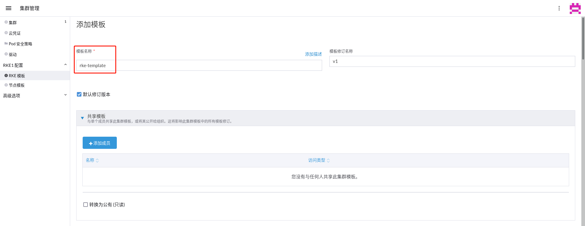

   在Rancher管理页面，访问集群管理=>RKE1配置=>节点模板，点击"添加模板"，选择"Oracle Cloud Infrastructure"，
   输入各个项目的信息，点击"创建"，

   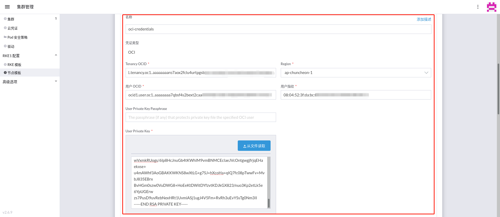

   输入各个项目的信息，

   

   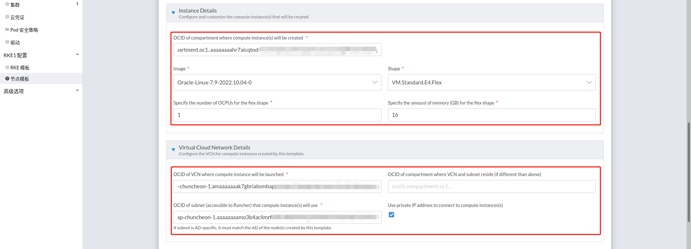

   输入各个项目的信息，点击"创建"，

   

ToDo：

https://rancher.server.learnoke.com

https://144.24.67.105/

[返回OKE中文文档集](../README.md)