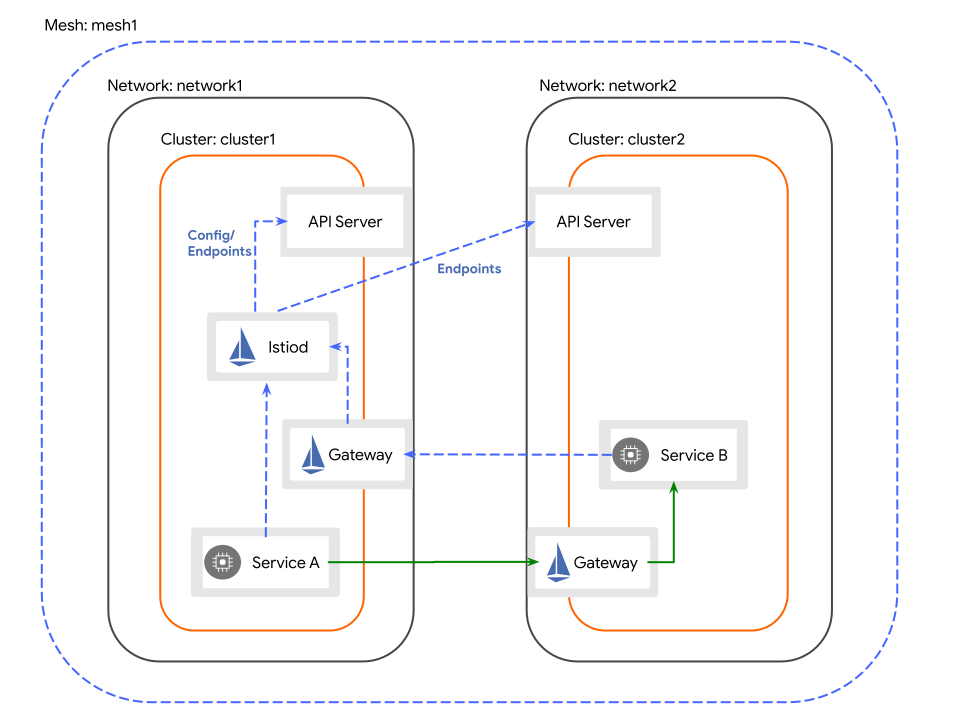

[返回OKE中文文档集](../../README.md)

[返回kubernetes中文文档集](../README.md)

# Istio之在不同的网络上安装Primary-Remote

架构图，




## 下载Istio

```
# 需要和Verrazzano安装的Istio版本相同，查看https://verrazzano.io/latest/docs/setup/prereqs/获取Istio版本
curl -L https://istio.io/downloadIstio | ISTIO_VERSION=1.15.3 TARGET_ARCH=x86_64 sh -
echo 'PATH=/root/istio-1.15.3/bin:$PATH' >> ~/.bashrc; source ~/.bashrc
```


## 将证书和钥匙插入集群中

```
cd istio-1.15.3
mkdir -p certs
pushd certs
```


```
make -f ../tools/certs/Makefile.selfsigned.mk root-ca
make -f ../tools/certs/Makefile.selfsigned.mk primary-cacerts
pushd
```

## 在karmada-apiserver上安装Istio

```
kapictl create namespace istio-system
kapictl create secret generic cacerts -n istio-system \
    --from-file=certs/primary/ca-cert.pem \
    --from-file=certs/primary/ca-key.pem \
    --from-file=certs/primary/root-cert.pem \
    --from-file=certs/primary/cert-chain.pem
```

## 为`v8o-karmada-member1`设置默认网络

```
export CTX_CLUSTER1=v8o-karmada-member1
kubectx ${CTX_CLUSTER1}
kubectl --context="${CTX_CLUSTER1}" get namespace istio-system && \
kubectl --context="${CTX_CLUSTER1}" label namespace istio-system topology.istio.io/network=network1
```


## 配置`v8o-karmada-member1`为主服务器

```
export CTX_CLUSTER1=v8o-karmada-member1
kubectx ${CTX_CLUSTER1}
kubectl edit istiooperators installed-state -n istio-system
---
spec:
  values:
    global:
      meshID: mesh1
      multiCluster:
        clusterName: "v8o-karmada-member1"
        enabled: ture
      network: "network1"
    pilot:
      env:
        EXTERNAL_ISTIOD: true
---
```

## 在`v8o-karmada-member1`中安装东西向网关

```
cd istio-1.15.3
samples/multicluster/gen-eastwest-gateway.sh \
    --mesh mesh1 --cluster ${CTX_CLUSTER1} --network network1 | \
    istioctl --context="${CTX_CLUSTER1}" install -y -f -
```

等待为东西向网关分配外部 IP 地址：

```
kubectl --context="${CTX_CLUSTER1}" get svc istio-eastwestgateway -n istio-system
---
NAME                    TYPE           CLUSTER-IP      EXTERNAL-IP      PORT(S)                                                           AGE
istio-eastwestgateway   LoadBalancer   10.92.241.173   152.69.232.161   15021:31497/TCP,15443:31661/TCP,15012:31657/TCP,15017:32438/TCP   11h
```

## 在`v8o-karmada-member1`中公开控制平面

```
kubectl apply --context="${CTX_CLUSTER1}" -n istio-system -f \
    samples/multicluster/expose-istiod.yaml
```

## 公开`v8o-karmada-member1`服务

```
kubectl --context="${CTX_CLUSTER1}" apply -n istio-system -f \
    samples/multicluster/expose-services.yaml
```

## 将控制平面群集设置为`v8o-karmada-member2`

```
export CTX_CLUSTER2=v8o-karmada-member2
kubectx ${CTX_CLUSTER2}
kubectl --context="${CTX_CLUSTER2}" create namespace istio-system
kubectl --context="${CTX_CLUSTER2}" annotate namespace istio-system topology.istio.io/controlPlaneClusters=${CTX_CLUSTER1}
```

## 为`v8o-karmada-member2`设置默认网络

```
kubectl --context="${CTX_CLUSTER2}" label namespace istio-system topology.istio.io/network=network2
```


## 配置`v8o-karmada-member2`为远程

```
export DISCOVERY_ADDRESS=$(kubectl \
    --context="${CTX_CLUSTER1}" \
    -n istio-system get svc istio-eastwestgateway \
    -o jsonpath='{.status.loadBalancer.ingress[0].ip}'); echo ${DISCOVERY_ADDRESS}
    
---
152.69.232.161
```


```
export CTX_CLUSTER2=v8o-karmada-member2
kubectx ${CTX_CLUSTER2}
kubectl edit istiooperators installed-state -n istio-system
---
spec:
  profile: external
  values:
    istiodRemote:
      injectionPath: /inject/cluster/v8o-karmada-member2/net/network2
    global:
      meshID: mesh1
      multiCluster:
        clusterName: "v8o-karmada-member2"
        enabled: ture
      network: "network2"    
      remotePilotAddress: ${DISCOVERY_ADDRESS}
---
```

## 在`v8o-karmada-member2`中安装东西向网关

```
samples/multicluster/gen-eastwest-gateway.sh \
    --mesh mesh1 --cluster ${CTX_CLUSTER2} --network network2 | \
    istioctl --context="${CTX_CLUSTER2}" install -y -f -
```

等待为东西向网关分配外部 IP 地址：

```
kubectl --context="${CTX_CLUSTER2}" get svc istio-eastwestgateway -n istio-system
---
NAME                    TYPE           CLUSTER-IP     EXTERNAL-IP     PORT(S)                                                           AGE
istio-eastwestgateway   LoadBalancer   10.93.158.64   144.24.90.139   15021:31742/TCP,15443:31680/TCP,15012:31899/TCP,15017:31972/TCP   11h
```

## 公开`v8o-karmada-member2`服务

```
kubectl --context="${CTX_CLUSTER2}" apply -n istio-system -f \
    samples/multicluster/expose-services.yaml
```

## Attach `v8o-karmada-member2` 作为一个远程集群到`v8o-karmada-member1`

```
istioctl x create-remote-secret \
    --context="${CTX_CLUSTER2}" \
    --name=${CTX_CLUSTER2} | \
    kubectl apply -f - --context="${CTX_CLUSTER1}"
```


## 验证安装

```
kubectl create --context="${CTX_CLUSTER1}" namespace sample
kubectl create --context="${CTX_CLUSTER2}" namespace sample
```


```
kubectl label --context="${CTX_CLUSTER1}" namespace sample \
    istio-injection=enabled
kubectl label --context="${CTX_CLUSTER2}" namespace sample \
    istio-injection=enabled
```


```
kubectl apply --context="${CTX_CLUSTER1}" \
    -f samples/helloworld/helloworld.yaml \
    -l service=helloworld -n sample
kubectl apply --context="${CTX_CLUSTER2}" \
    -f samples/helloworld/helloworld.yaml \
    -l service=helloworld -n sample
```


```
kubectl apply --context="${CTX_CLUSTER1}" \
    -f samples/helloworld/helloworld.yaml \
    -l version=v1 -n sample
```

```
kubectl get pod --context="${CTX_CLUSTER1}" -n sample -l app=helloworld
```


```
kubectl apply --context="${CTX_CLUSTER2}" \
    -f samples/helloworld/helloworld.yaml \
    -l version=v2 -n sample
```

```
kubectl get pod --context="${CTX_CLUSTER2}" -n sample -l app=helloworld
```


```
kubectl apply --context="${CTX_CLUSTER1}" \
    -f samples/sleep/sleep.yaml -n sample
kubectl apply --context="${CTX_CLUSTER2}" \
    -f samples/sleep/sleep.yaml -n sample
```


```
kubectl get pod --context="${CTX_CLUSTER1}" -n sample -l app=sleep
```

```
kubectl get pod --context="${CTX_CLUSTER2}" -n sample -l app=sleep
```


Repeat this request several times and verify that the `HelloWorld` version should toggle between `v1` and `v2`:

```
kubectl exec --context="${CTX_CLUSTER1}" -n sample -c sleep \
    "$(kubectl get pod --context="${CTX_CLUSTER1}" -n sample -l \
    app=sleep -o jsonpath='{.items[0].metadata.name}')" \
    -- curl -sS helloworld.sample:5000/hello
```

```
kubectl exec --context="${CTX_CLUSTER2}" -n sample -c sleep \
    "$(kubectl get pod --context="${CTX_CLUSTER2}" -n sample -l \
    app=sleep -o jsonpath='{.items[0].metadata.name}')" \
    -- curl -sS helloworld.sample:5000/hello
```


## (Optional)卸载Istio

```
istioctl uninstall --purge
```

```
kubectl delete namespace istio-system
```


参考文档：

- [Istio / Install Primary-Remote on different networks](https://istio.io/latest/docs/setup/install/multicluster/primary-remote_multi-network/)
- [Working with Istio on non-flat network | karmada](https://karmada.io/docs/userguide/service/working-with-istio-on-non-flat-network)


[返回kubernetes中文文档集](../README.md)

[返回OKE中文文档集](../../README.md)

